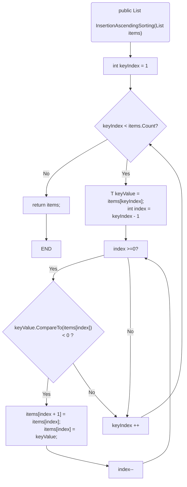
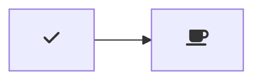
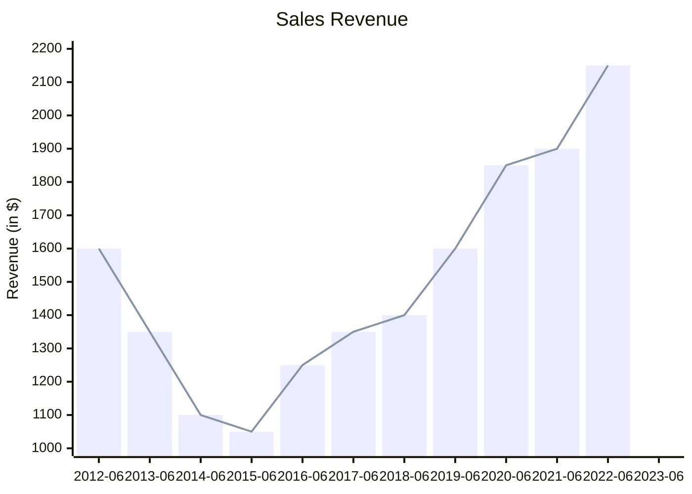

<!-- 插入排序法 Mermaid 版本 -->

```mermaid
flowchart TB
    A("public List<T> 
       InsertionAscendingSorting(List<T> 
       items)") --> B["int keyIndex = 1"]
    B --> C{"keyIndex < items.Count?"}
    C -->|"No"| D["return items;"]    
    C -->|"Yes"| E["T keyValue = items[keyIndex];
                    int index = keyIndex - 1"]
    E --> F["index >=0?"]
    F -->|"Yes"| G{"keyValue.CompareTo(items[index])
                     < 0 ?"}
    F -->|"No"| H["keyIndex ++"]
    H --> C
    G -->|"Yes"| I["items[index + 1] = items[index];
                    items[index] = keyValue;"]
    G -->|"No"| H
    I --> J["index--"]
    J --> F
    D --> END["END"]
```

```mermaid
graph LR
    fa:fa-check-->fa:fa-coffee
```

```mermaid
    xychart-beta
    title "Sales Revenue"
    x-axis [2012-06, 2013-06, 2014-06, 2015-06, 2016-06, 2017-06, 2018-06, 2019-06, 2020-06, 2021-06, 2022-06, 2023-06]
    y-axis "Revenue (in $)" 1000 --> 2200
    bar [1600, 1350, 1100, 1050, 1250, 1350, 1400, 1600, 1850, 1900, 2150]
    line [1600, 1350, 1100, 1050, 1250, 1350, 1400, 1600, 1850, 1900, 2150]
```

```mermaid
info
```
