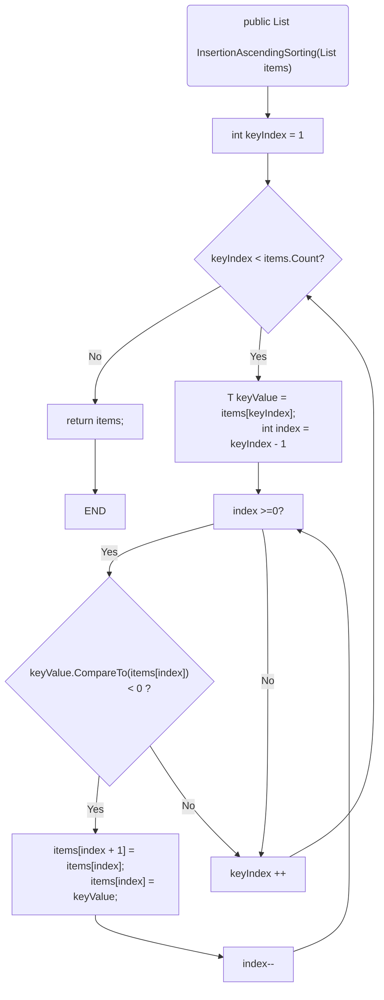

<div class="summary">
<br/>應用所需：1. Markdown 語法基礎
<br/>&emsp;&emsp;&emsp;&emsp;&emsp;2. 本篇為 Mermaid 版本：v10.8.0
<br/>解決問題：使用 Markdwon 腳本也可以實現畫出流程圖 (※建議不複雜的圖形，否則不好維護調整)
<br/>官網連結：<a href="https://mermaid.js.org/">連結</a>
<br/>官方工具：<a href="https://mermaid.live/">線上即時編輯器連結</a>
<br/>基本介紹：本篇分為4大部分。
<br/>第一部分：Mermaid 工具介紹
<br/>第二部分：如何在 VS Code 用 Mermaid
<br/>第三部分：Mermaid 官方在線編輯器
<br/>第四部分：實作 Mermaid 流程圖

</div>
<div class="title">
    <br/><hr class="titleinner">
	<span></span>
	<hr class="titleinner"><br/>
</div>

<br/><br/>

<h1>第一部分：Mermaid 工具介紹</h1>

<h2>Step 1：介紹</h2>
Mermaid 是圖形即代碼(diagrams-as-code)的工具類型，官網的介紹相當清楚。
<br/>以下是<a href="https://mermaid.js.org/intro/">官網</a>對 Mermaid 的介紹：

```markdown
關於 Mermaid：

Mermaid 允許你使用文字和程式碼創建圖表和視覺化。

它是一個基於 JavaScript 的圖表繪製工具，可渲染 Markdown 啟發的文字定義以動態建立和修改圖表。
```

<br/>

<br/> 
<br/><br/>

<h2>Step 2：優缺點</h2>
相較於 GitMind、Draw.io、Visio、PowerPoint 等主流畫流程圖的工具
<br/>Mermaid 有以下[優點]：

{:class="table table-bordered"}
| 1. Markdown 語法  | ： | Mermaid 使用 Markdown 語法，對於熟悉 Markdown 的使用者來說，學習成本較低。 | 
| 2. 跨平台  | ： | Mermaid 支持在網頁和 Node.js 環境下運行，可以在不同平台上使用。 | 
| 3. 易於修改  | ： | Mermaid 的 Markdown 語法易於修改，可以在 Markdown 文件中直接編輯圖形，而不需要使用專門的編輯器。 | 
| 4. 輕量級  | ： | Mermaid 的代碼量相對較小，編譯速度快，運行效率高。 | 
| 5. 支持多種格式  | ： | Mermaid 支持將圖形導出為多種格式，如 PNG、SVG、PDF 等。 | 
| 6. 一致性  | ： | 基於 Markdown 語法，相同文字下，圖形的顯示結果將會一致，如時序圖、類圖。 | 

<br/>Mermaid 有以下[缺點]：

{:class="table table-bordered"}
| 1. 輕量級  | ： | 由於輕量級 Mermaid 的功能相對較簡單，避免繪製過於複雜的圖形，如適合繪製流程圖、時序圖等。 | 
| 2. 技術門檻  | ： | Mermaid 使用 Markdown 語法，未使用過此語法使用者，需要學習成本。 | 
| 3. 功能限制  | ： | Mermaid 的功能受到 Markdown 語法的限制，無法繪製複雜的圖形、不支持動態圖形效果。 | 

<br/><br/>
<h2>Step 3：使用對象 & 如何使用</h2>
基於上述優缺點，如果不熟悉 Markdown 語法、或者畫的圖形較複雜，則不建議使用 Mermaid。
<br/>官網的說明寫得很完整，並且約 300~400 人一起維護此開源，左側入門(Getting Started)，列出五種方式使用
<br/>※本篇介紹 - 1. 即時線上編輯(Live Editor)
<br/>&emsp;&emsp;&emsp;&emsp;&emsp; - 2. 使用 Mermaid 插件整合 (Using Mermaid Plugins and Integrations) ※Visual Studio Code
<br/> 
<br/><br/>

<h2>Step 4：支援的圖形</h2>
Mermaid 版本：v10.8.0 共支援 18 種圖形繪出
<br/>

{:class="table table-bordered"}
| 名稱 | 分隔 | 扼要解釋 | 
| ---  | --- | --- | 
| 流程圖 (Flowchart)  | ： | 用於描述流程、流程或操作的圖形表示。 |
| 序列圖 (Sequence Diagram) | ： | 用於描述對象之間交互的圖形表示。 |
| 類圖 (Class Diagram) | ： | 用於描述類之間的關係和屬性的圖形表示。 |
| 狀態圖 (State Diagram) | ： | 用於描述對象的狀態和狀態轉換的圖形表示。 |
| 實體關係圖 (Entity Relationship Diagram) | ： | 用於描述實體之間的關係和屬性的圖形表示。 |
| 用戶旅程圖 (User Journey) | ： | 用於描述用戶在系統中的行為和操作的圖形表示。 |
| 甘特圖 (Gantt)  | ： | 用於描述項目的時間軸和進度的圖形表示。 |
| 餅圖 (Pie Chart)  | ： | 用於描述數據的比例和百分比的圖形表示。 |
| 象限圖 (Quadrant Chart) | ： | 用於描述數據的分類和分布的圖形表示。 |
| 需求圖 (Requirement Diagram) | ： | 用於描述系統需求和功能的圖形表示。 |
| Git流程圖 (Gitgraph (Git) Diagram) | ： | 用於描述Git分支和提交的圖形表示。 |
| C4圖 (C4 Diagram)  | ： | 用於描述系統架構和結構的圖形表示。 |
| 心智圖 (Mindmaps)  | ： | 用於描述思維和概念的圖形表示。 |
| 時間線圖 (Timeline) | ： | 用於描述時間軸和事件的圖形表示。 |
| 交互UML (Zenuml) | ： | 用於描述UML圖和設計的圖形表示。 |
| 流圖 (Sankey) | ： | 用於描述流程和流動的圖形表示。 |
| XY軸圖表 (XYChart) | ： | 用於描述數據的關係和趨勢的圖形表示。 |
| 區塊流程圖 (Block Diagram) | ： | 用於描述系統結構和組成的圖形表示。 |

<br/>Diagram Syntax 的最下面也提供了基本範例，如圖：
<br/> 
<br/><br/>

<br/><br/>

<h1>第二部分：如何在 VS Code 用 Mermaid</h1>

<h2>Step 1：安裝 Markdown Preview Mermaid Support</h2>
選擇左邊的 Extensions -> 輸入 Markdown Preview Mermaid Support -> 安裝 Install
<br/> 
<br/><br/>

<h2>Step 2：建立Md檔案</h2>
新建一個副檔名為 .md 的檔案後，將 Mermaid 的 FlowChart 範例碼貼上

```Markdown
 ```mermaid
graph LR
    A[Square Rect] -- Link text --> B((Circle))
    A --> C(Round Rect)
    B --> D{Rhombus}
    C --> D

```

<br/>代碼貼上後，選擇最右邊的預覽 ※熱鍵：ctrl + shift + v
<br/> 
<br/><br/>

<h2>Step 3：顯示圖形結果</h2>
執行後就會出現流程圖的結果
<br/> 
<br/><br/>

<h2>Step 4：安裝高量顯示優化套件</h2>
如果直接在 .md 檔案中編輯，會發現 mermaid 的顏色都是白色的，在撰寫的過程中十分不方便
<br/>可安裝 Mermaid Markdown Syntax Highlighting 套件來解決此問題
<br/> 
<br/><br/>

<h2>Step 5：高量顯示優化套件-結果</h2>
比較前後差異，可以發現在編輯上會相當方便。
<br/> 
<br/><br/>

<h1>第三部分：Mermaid 官方在線編輯器</h1>

<h2>Step 1：開啟線上編輯</h2>
在官網的教學文件中會有<a href="https://mermaid.js.org/">Live Editor</a>連結，點擊跳轉
<br/> 
<br/><br/>

<h2>Step 2：編輯畫面</h2>
如果有連網路，可以在編輯頁面中進行編輯，基本上操作與VS Code上一致
<br/> 
<br/><br/>


<h1>第四部分：實作 Mermaid 流程圖</h1>

<h2>Step 1：入門學習</h2>
<a href="https://mermaid.js.org/"> Mermaid 官網教學文件</a>寫得相當不錯，如果全部讀完大約1小時左右即可
<br/>雖然一共有18種圖形，但是部分圖形的文本量是相當少的。
<br/>複雜的功能，繪畫圖形也是官方為了未來給 AI 使用時，便於撰寫一致性的結果，
<br/>※ Mermaid Chart 是要收費的版本，可在 ChatGpt 上做插件使用，如果免費想體驗，可以試用14天
<br/><br/>

<h2>Step 2：插入排序法-流程圖 - 結果比較</h2>
將<a href="https://gotoa1234.github.io/2024/02/25/1.html">Visustin V8 Demo</a>工具自動畫出的流程圖，做個轉換，可以得到以下代碼：
<br/>※代碼來源：<a href="https://gotoa1234.github.io/2023/02/19/1.html">插入排序法</a>

```Markdown
<!-- 插入排序法 Mermaid 版本 -->


<br/> 用 Visustin V8 Demo 的插入排序法流程圖如下：
<br/> 

<br/> 用 Mermaid 轉換後插入排序法流程圖如下：
<br/> 

<br/>在更複雜的流程圖如果後續要維護會有代碼調整的困難，但以未來結合AI的實用來看。
<br/> Mermaid 很有機會成為未來圖形即代碼(diagrams-as-code)這一類型上的標準。
<br/><br/>


